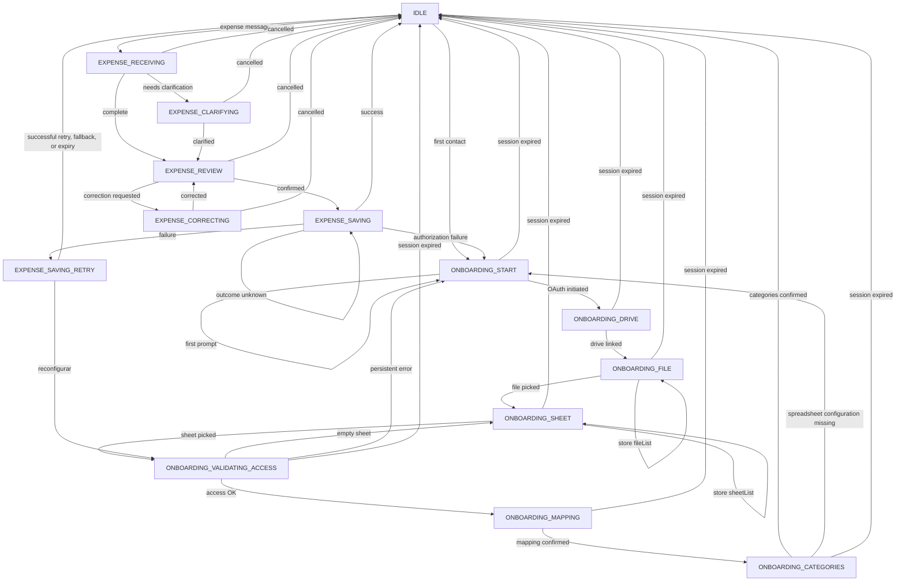

# FSM States — Gastto

> **Why this document exists:** The FSM is the operational heart of the system. An agent that generates message-handling code without knowing the valid states and their transitions will produce incoherent logic. ADR-003 mentions the FSM but is not the right place to consult transitions during development.
> **Related:**
>
> - [ADR-003 · Estado Conversacional: FSM Persistida en PostgreSQL](../adr/adr.md#adr-003--estado-conversacional-fsm-persistida-en-postgresql)
> - [ADR-014 · FSM Eager Advance](../adr/ADR-014-fsm-eager-advance.md)

---

## State table

| State                          | Description                                                 | Valid outgoing transitions                                                                    | Timeout |
| ------------------------------ | ----------------------------------------------------------- | --------------------------------------------------------------------------------------------- | ------- |
| `IDLE`                         | No active flow                                              | → `ONBOARDING_START` \| `EXPENSE_RECEIVING`                                                   | —       |
| `ONBOARDING_START`             | First contact, no spreadsheet linked                        | → `ONBOARDING_START` (set `promptShown`) \| `ONBOARDING_DRIVE` \| `IDLE`                      | 30 min  |
| `ONBOARDING_DRIVE`             | Waiting for OAuth connection                                | → `ONBOARDING_DRIVE` \| `ONBOARDING_FILE` \| `IDLE`                                           | 30 min  |
| `ONBOARDING_FILE`              | Waiting for file selection                                  | → `ONBOARDING_FILE` (store `fileList` / `step`) \| `ONBOARDING_SHEET` \| `IDLE`               | 30 min  |
| `ONBOARDING_SHEET`             | Waiting for sheet selection                                 | → `ONBOARDING_SHEET` (store `sheetList` / `step`) \| `ONBOARDING_VALIDATING_ACCESS` \| `IDLE` | 30 min  |
| `ONBOARDING_VALIDATING_ACCESS` | Validating read/write access on selected sheet              | → `ONBOARDING_MAPPING` \| `ONBOARDING_SHEET` \| `ONBOARDING_START` \| `IDLE`                  | 30 min  |
| `ONBOARDING_MAPPING`           | Waiting for column-mapping confirmation                     | → `ONBOARDING_MAPPING` \| `ONBOARDING_CATEGORIES` \| `ONBOARDING_START` \| `IDLE`             | 30 min  |
| `ONBOARDING_CATEGORIES`        | Waiting for category confirmation                           | → `IDLE` \| `ONBOARDING_CATEGORIES` \| `ONBOARDING_START`                                     | 30 min  |
| `EXPENSE_RECEIVING`            | Message received, processing NLP                            | → `EXPENSE_CLARIFYING` \| `EXPENSE_REVIEW` \| `IDLE`                                          | —       |
| `EXPENSE_CLARIFYING`           | Waiting for user clarification                              | → `EXPENSE_REVIEW` \| `IDLE`                                                                  | 10 min  |
| `EXPENSE_REVIEW`               | Summary sent, waiting for confirmation                      | → `EXPENSE_SAVING` \| `EXPENSE_CORRECTING` \| `IDLE`                                          | 10 min  |
| `EXPENSE_CORRECTING`           | Applying user correction                                    | → `EXPENSE_REVIEW` \| `IDLE`                                                                  | —       |
| `EXPENSE_SAVING`               | Writing to the spreadsheet or retaining an unresolved claim | → `EXPENSE_SAVING` \| `IDLE` \| `EXPENSE_SAVING_RETRY` \| `ONBOARDING_START`                  | —       |
| `EXPENSE_SAVING_RETRY`         | Waiting for a user decision after a retryable failed save   | → `EXPENSE_SAVING_RETRY` \| `IDLE` \| `ONBOARDING_VALIDATING_ACCESS`                          | 10 min  |

---

## Eager advance

Deterministic forward transitions — those that do not require user input or confirmation — may auto-trigger the next use case immediately after the state is persisted. See [ADR-014 · FSM Eager Advance](../adr/ADR-014-fsm-eager-advance.md) for the full decision, rules, and list of applicable transitions.

Current and planned eager-advance transitions:

- `ONBOARDING_DRIVE` → `ONBOARDING_FILE`: OAuth callback triggers file discovery.
- `ONBOARDING_FILE` → `ONBOARDING_SHEET`: file selection triggers sheet discovery.
- `ONBOARDING_SHEET` → `ONBOARDING_VALIDATING_ACCESS`: sheet confirmation (single-sheet auto-confirm, number, or name match) triggers access validation.
- `ONBOARDING_VALIDATING_ACCESS` → `ONBOARDING_MAPPING`: successful access validation triggers column-mapping inference.
- `EXPENSE_REVIEW` → `EXPENSE_SAVING`: user confirmation triggers save.
- `EXPENSE_SAVING` → `IDLE`: a confirmed save persists the record and triggers final confirmation.
- `EXPENSE_REVIEW` with pending queue entries: confirmation, cancellation, or second-stage timeout deterministically advances exactly one oldest queued message after the active outcome is delivered.
- `EXPENSE_SAVING_RETRY` → `ONBOARDING_VALIDATING_ACCESS`: `reconfigurar` restarts validation and eager column inference for the active Google spreadsheet.

Transitions that present a list or require explicit confirmation (e.g., `ONBOARDING_FILE` self-transition, `ONBOARDING_MAPPING` self-transition) do **not** use eager advance.

An authorization failure during `EXPENSE_SAVING` transitions to `ONBOARDING_START` with `promptShown: true`. The recovery copy has already instructed the user to reply `empezar`, so that next message is consumed immediately as the existing Google provider-selection alias and starts OAuth. The failed expense is not retained or replayed automatically.

---

## Transition diagram (Mermaid)

---

## `state_payload` per state

The `state_payload` column in the `conversation_states` table is a `JSONB` blob whose shape depends on the current state. Fields that are not relevant to the current state must be `null` or absent.

| State                          | Relevant `state_payload` fields                                                                                                                                               | Meaning                                                                                                                                                                                                              |
| ------------------------------ | ----------------------------------------------------------------------------------------------------------------------------------------------------------------------------- | -------------------------------------------------------------------------------------------------------------------------------------------------------------------------------------------------------------------- |
| `IDLE`                         | _(empty or `{}`)_                                                                                                                                                             | Nothing to persist                                                                                                                                                                                                   |
| `ONBOARDING_START`             | `promptShown: boolean`, `provider?: 'google' \| 'microsoft'`                                                                                                                  | `promptShown` tracks whether the welcome/provider prompt has been displayed; authorization recovery sets it to `true` because the recovery copy already prompts for `empezar`; `provider` may be present transiently |
| `ONBOARDING_DRIVE`             | `oauth_state: string`                                                                                                                                                         | PKCE / OAuth state token for CSRF protection                                                                                                                                                                         |
| `ONBOARDING_FILE`              | `drive_folder_id?: string`, `files: Array<{id, name}>`                                                                                                                        | List of candidate files to show the user                                                                                                                                                                             |
| `ONBOARDING_SHEET`             | `file_id: string`, `sheets: Array<{name, id}>`                                                                                                                                | Selected file and its internal sheets                                                                                                                                                                                |
| `ONBOARDING_VALIDATING_ACCESS` | `selectedFileId: string`, `selectedFileName: string`, `selectedSheetName: string`, `provider: SpreadsheetProvider`, `sheetList?: SheetInfo[]`, `step?: 'empty-sheet-confirm'` | File and sheet being validated; `step` and `sheetList` present when transitioning back to `ONBOARDING_SHEET` after empty-sheet                                                                                       |
| `ONBOARDING_MAPPING`           | `file_id`, `sheet_id`, `headers: string[]`, `mapping: Record<string, string>`                                                                                                 | Detected column mapping waiting for confirmation                                                                                                                                                                     |
| `ONBOARDING_CATEGORIES`        | `file_id`, `sheet_id`, `mapping`, `categories: string[]`                                                                                                                      | Detected category list waiting for confirmation                                                                                                                                                                      |
| `EXPENSE_RECEIVING`            | `raw_message: string`, `extracted?: ExtractedExpense`                                                                                                                         | The incoming message and any partial NLP result                                                                                                                                                                      |
| `EXPENSE_CLARIFYING`           | `raw_message`, `missing_fields: string[]`, `partial: ExtractedExpense`                                                                                                        | Which fields the user still needs to provide                                                                                                                                                                         |
| `EXPENSE_REVIEW`               | normalized review fields; `reviewBinding: { operationId: string, revision: number, presentedAt: string \| null }`; `reminderSent`; stage flags                                | The persisted reviewed expense and exact presented version. Missing legacy binding is unbound until persisted and re-presented.                                                                                      |
| `EXPENSE_CORRECTING`           | `expense: ExpenseEntity`, `correction_field: string`                                                                                                                          | Which field the user wants to correct                                                                                                                                                                                |
| `EXPENSE_SAVING`               | `expense: ExpenseEntity`, `attempt: number`                                                                                                                                   | Current save attempt count                                                                                                                                                                                           |
| `EXPENSE_SAVING_RETRY`         | `expense: ExpenseReviewPayload`, `failureCode`, `firstAttemptAt`, `attemptCount: 1`, `actionBinding: { operationId, revision, presentedAt } \| null`                          | Confirmed expense retained for one exact, successfully presented user-initiated retry. Legacy missing bindings remain unbound until re-presented.                                                                    |
| `EXPENSE_UNDO_CONFIRMING`      | `pendingExpenseId`, `actionBinding: { operationId, revision, presentedAt } \| null`                                                                                           | Latest expense offered for delayed undo. Requires a non-null future expiry and a reply captured strictly after successful presentation.                                                                              |

Save, retry, and undo execution may additionally carry `executionClaim: { claimId, kind, operationId, sourceMessageId, status, target }`. The immutable target binds the external effect. `in_flight` and `outcome_unknown` claims block unrelated transitions and are never released or replayed automatically after lease expiry or restart. Append/delete transport failures after the mutation request is sent, provider 5xx responses, and local finalization failures after remote success retain `outcome_unknown`; failures proven to occur before the mutation may clear or enter the existing explicit retry flow.

## Semantic observation by state

Semantic routing does not add a state or transition. Runtime projection supports
only the state/substep pairs enumerated by `semantic-policy-v1`; unsupported states,
unknown substeps, malformed payloads, expired snapshots, and unresolved financial
claims produce metadata-only failure/stale observations. Projection allowlists the
current question, missing amount/currency fields, bounded expense summary, and
displayed option positions/labels. It never exposes the full `state_payload`,
operation bindings, claims, revisions, or provider identifiers.

The FSM remains authoritative in every mode. `shadow` records a proposal and
executes the deterministic handler. `off` skips the model. `enabled` may execute
validated expense proposals only in `IDLE`, `EXPENSE_RECEIVING`,
`EXPENSE_CLARIFYING`, and `EXPENSE_REVIEW`. The typed dispatcher revalidates
revision, state, expiry, execution ownership, and the absence of unresolved
financial claims before invoking exactly one action-specific boundary.

Recognition and clarification completion can reach the existing
`EXPENSE_CLARIFYING` or `EXPENSE_REVIEW` states. Clarification replacement commits
only through the new interpretation result, so extractor failure preserves the old
draft. Review correction advances the review binding and requires a fresh
presentation and explicit confirmation. Review `register_expense` admits only a raw
pending-queue item and leaves the active review unchanged. Semantic dispatch has no
save, retry, delete, confirmation, cancellation, or arbitrary-transition authority;
all other enabled state/action pairs fail closed.

---

## Timeouts

### How timeouts are implemented

Timeouts are **BullMQ jobs with a `delay`**, never cron jobs.

Every `ONBOARDING_*` state has an explicit transition to `IDLE`. Generic onboarding expiration uses the strict `TransitionConversationState` validator, clears `state_payload` and `expires_at`, and sends the existing timeout notification.

1. When entering a state that has a timeout, the FSM enqueues a BullMQ job of type `fsm-timeout` with `delay` equal to the state's TTL.
2. The job payload contains the `userId` and the `expectedState` at the time of enqueueing.
3. When the delayed job fires, the worker checks whether the user is **still** in `expectedState`.
   - If yes → transition to `IDLE` and notify the user: _"El proceso se canceló por inactividad. Escribe de nuevo cuando quieras."_
   - If no → the job is a no-op (the user already moved on).

### Timeout values

| State group                        | Timeout    | Job type                                                                                                                                                            |
| ---------------------------------- | ---------- | ------------------------------------------------------------------------------------------------------------------------------------------------------------------- |
| Onboarding states (`ONBOARDING_*`) | 30 minutes | `fsm-timeout` with `delay: 30 * 60 * 1000`                                                                                                                          |
| `EXPENSE_CLARIFYING`               | 10 minutes | `fsm-timeout` with `delay: 10 * 60 * 1000`                                                                                                                          |
| `EXPENSE_REVIEW`                   | 10 minutes | First expiry advances the review binding and grants one presentation grace period; second expiry cancels the active draft and advances the exact oldest queue item. |
| `EXPENSE_SAVING_RETRY`             | 10 minutes | `fsm-timeout` with `delay: 10 * 60 * 1000`                                                                                                                          |

---

## Rule: FSM exclusivity

> **Never add conditional conversational flow logic outside the FSM.**

All branching based on "what the user said" or "what step we are in" must be expressed as a state transition inside the FSM. If you find yourself writing an `if` in a service that checks `user.status === 'onboarding'` or `if (message.includes('cancelar'))`, that logic belongs inside the FSM transition table, not in the service layer.

The only place where branching on state is allowed is the **FSM engine** (`src/application/services/ConversationFSM.ts` or equivalent). Everywhere else, the code receives a state and executes the action associated with that state, without deciding what the next state should be.
