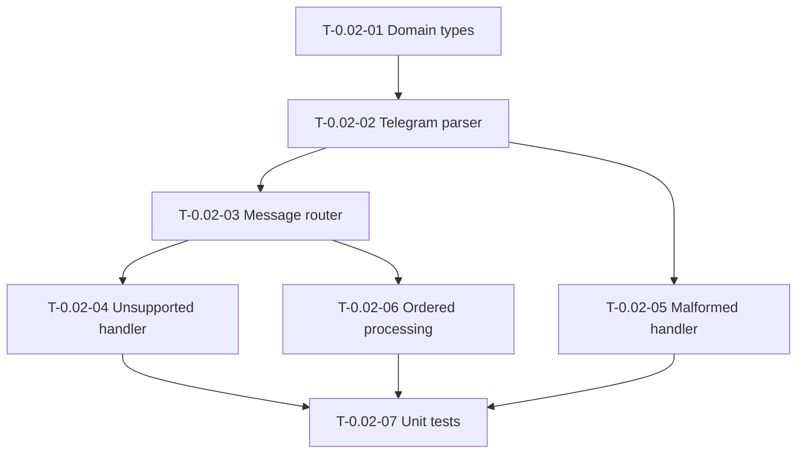

# Task Dependency Tree

## Mermaid Graph

## Critical Path

The longest chain of dependent tasks is:

**T-0.02-01 → T-0.02-02 → T-0.02-03 → T-0.02-06 → T-0.02-07**

- Duration: 1.5h + 2h + 1.5h + 2h + 2h = **9 hours**

This path determines the minimum theoretical duration if all tasks were executed sequentially by one developer. Parallel work on `T-0.02-04` and `T-0.02-05` can reduce wall-clock time.

## Summary Table

| Task ID   | Title                                             | Depends on                      | Estimated Hours |
| --------- | ------------------------------------------------- | ------------------------------- | --------------- |
| T-0.02-01 | Define domain message types and value objects     | None                            | 1.5h            |
| T-0.02-02 | Implement Telegram payload parser                 | T-0.02-01                       | 2.0h            |
| T-0.02-03 | Implement message router / dispatcher by type     | T-0.02-02                       | 1.5h            |
| T-0.02-04 | Implement unsupported message handler             | T-0.02-03                       | 1.0h            |
| T-0.02-05 | Implement malformed payload handler               | T-0.02-02                       | 1.5h            |
| T-0.02-06 | Implement ordered processing guarantee            | T-0.02-03                       | 2.0h            |
| T-0.02-07 | Write unit tests covering all 4 Gherkin scenarios | T-0.02-04, T-0.02-05, T-0.02-06 | 2.0h            |

**Total Estimated Hours: 11.5**
