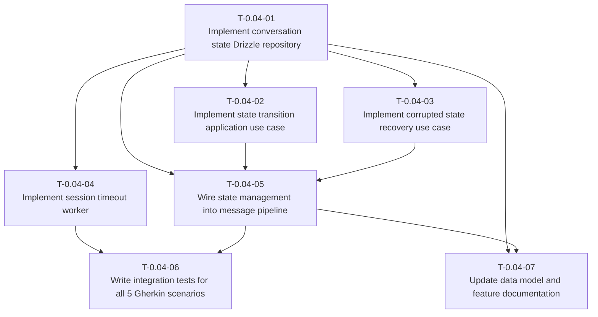

# Dependency Tree — HU-0.04

## Mermaid Diagram

## Critical Path

The longest chain of dependent tasks that determines the minimum duration:

**T-0.04-01 → T-0.04-02 → T-0.04-05 → T-0.04-06**

Duration: **3h + 2h + 2h + 3h = 10 hours**

Other paths:

- T-0.04-01 → T-0.04-03 → T-0.04-05 → T-0.04-06 = 3 + 2 + 2 + 3 = **10 hours**
- T-0.04-01 → T-0.04-04 → T-0.04-06 = 3 + 3 + 3 = **9 hours**
- T-0.04-01 → T-0.04-07 = 3 + 1 = **4 hours** (docs, can run in parallel)

## Summary Table

| Task ID   | Title                                               | Depends on                      | Estimated Hours |
| --------- | --------------------------------------------------- | ------------------------------- | --------------- |
| T-0.04-01 | Implement conversation state Drizzle repository     | None                            | 3               |
| T-0.04-02 | Implement state transition application use case     | T-0.04-01                       | 2               |
| T-0.04-03 | Implement corrupted state recovery use case         | T-0.04-01                       | 2               |
| T-0.04-04 | Implement session timeout worker                    | T-0.04-01                       | 3               |
| T-0.04-05 | Wire state management into message pipeline         | T-0.04-01, T-0.04-02, T-0.04-03 | 2               |
| T-0.04-06 | Write integration tests for all 5 Gherkin scenarios | T-0.04-04, T-0.04-05            | 3               |
| T-0.04-07 | Update data model and feature documentation         | T-0.04-01, T-0.04-05            | 1               |

**Total estimated hours:** 16
