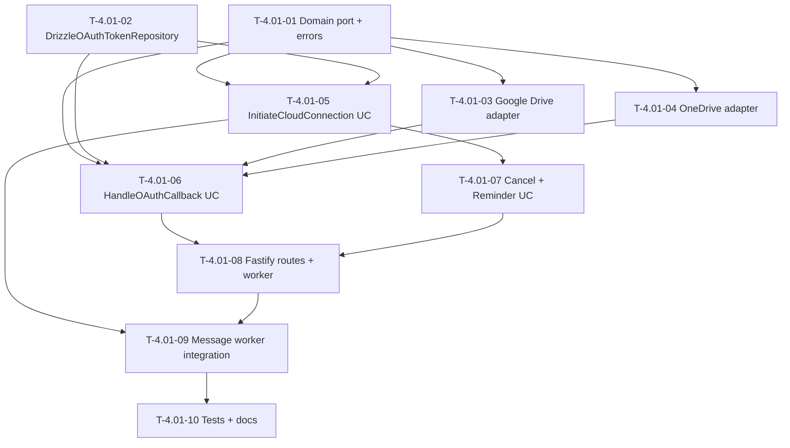

# Dependency Tree

## Mermaid Graph

## Critical Path

The longest dependency chain determines the minimum duration:

**T-4.01-01 → T-4.01-03 → T-4.01-06 → T-4.01-08 → T-4.01-09 → T-4.01-10**

Duration: **2 + 3 + 2 + 2 + 2 + 2 = 13 hours**

Parallel work (off critical path):

- T-4.01-02 (2h) can run alongside T-4.01-01
- T-4.01-04 (3h) can run in parallel with T-4.01-03
- T-4.01-05 (2h) and T-4.01-07 (2h) branch from earlier tasks

## Summary Table

| Task ID   | Title                                                       | Depends on                                 | Estimated Hours |
| --------- | ----------------------------------------------------------- | ------------------------------------------ | --------------- |
| T-4.01-01 | Define OAuth service port and domain errors                 | None                                       | 2               |
| T-4.01-02 | Implement DrizzleOAuthTokenRepository                       | None                                       | 2               |
| T-4.01-03 | Implement Google Drive OAuth adapter                        | T-4.01-01                                  | 3               |
| T-4.01-04 | Implement OneDrive OAuth adapter                            | T-4.01-01                                  | 3               |
| T-4.01-05 | Implement InitiateCloudConnection use case                  | T-4.01-01, T-4.01-02                       | 2               |
| T-4.01-06 | Implement HandleOAuthCallback use case                      | T-4.01-01, T-4.01-02, T-4.01-03, T-4.01-04 | 2               |
| T-4.01-07 | Implement cancel and reminder use cases                     | T-4.01-05                                  | 2               |
| T-4.01-08 | Implement Fastify OAuth callback routes and reminder worker | T-4.01-06, T-4.01-07                       | 2               |
| T-4.01-09 | Integrate connection flow into message worker               | T-4.01-05, T-4.01-08                       | 2               |
| T-4.01-10 | Write tests and feature documentation                       | T-4.01-08, T-4.01-09                       | 2               |
