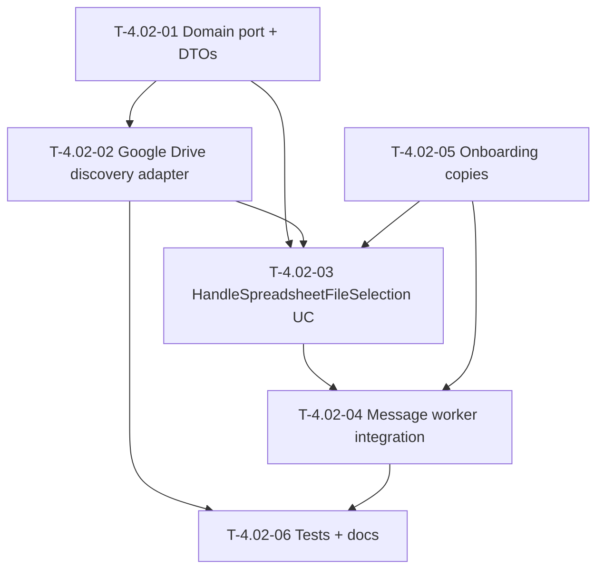

# Dependency Tree

## Mermaid Graph

## Critical Path

The longest dependency chain determines the minimum duration:

**T-4.02-01 → T-4.02-02 → T-4.02-03 → T-4.02-04 → T-4.02-06**

Duration: **1.5 + 2 + 2.5 + 1.5 + 2 = 9.5 hours**

Parallel work (off critical path):

- T-4.02-05 (1h) can run in parallel with T-4.02-02 and T-4.02-03.

## Summary Table

| Task ID   | Title                                             | Depends on           | Estimated Hours |
| --------- | ------------------------------------------------- | -------------------- | --------------- |
| T-4.02-01 | Define CloudStorage file discovery port and DTOs  | None                 | 1.5             |
| T-4.02-02 | Implement Google Drive file discovery adapter     | T-4.02-01            | 2               |
| T-4.02-03 | Implement HandleSpreadsheetFileSelection use case | T-4.02-01, T-4.02-02 | 2.5             |
| T-4.02-04 | Integrate file selection into message worker      | T-4.02-03, T-4.02-05 | 1.5             |
| T-4.02-05 | Add onboarding copies for file selection flow     | None                 | 1               |
| T-4.02-06 | Write tests and feature documentation             | T-4.02-02, T-4.02-04 | 2               |
