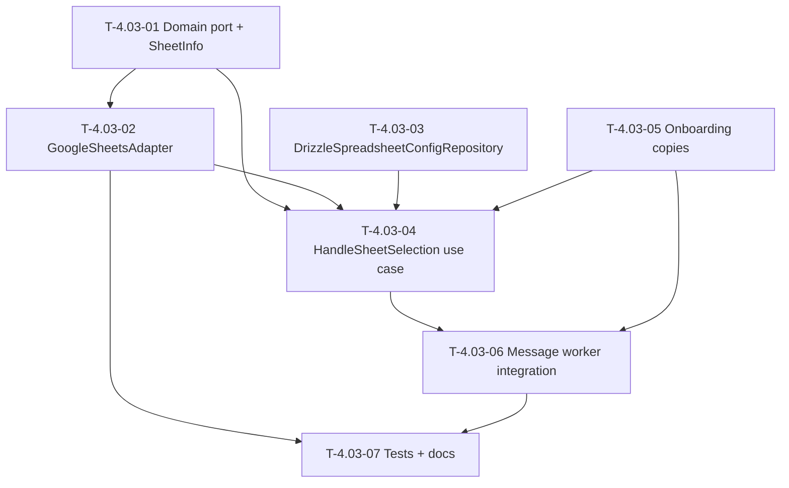

# Dependency Tree

## Mermaid Graph

## Critical Path

The longest dependency chain determines the minimum duration:

**T-4.03-01 → T-4.03-02 → T-4.03-04 → T-4.03-06 → T-4.03-07**

Duration: **0.5 + 1.5 + 2 + 0.5 + 1.5 = 6 hours**

Parallel work (off critical path):

- T-4.03-03 (1h) can run in parallel with T-4.03-01 and T-4.03-02.
- T-4.03-05 (0.5h) can run in parallel with T-4.03-03 and T-4.03-04.

## Summary Table

| Task ID   | Title                                         | Depends on                      | Estimated Hours |
| --------- | --------------------------------------------- | ------------------------------- | --------------- |
| T-4.03-01 | Extend SpreadsheetPort with listSheets        | None                            | 0.5             |
| T-4.03-02 | Implement GoogleSheetsAdapter                 | T-4.03-01                       | 1.5             |
| T-4.03-03 | Create DrizzleSpreadsheetConfigRepository     | None                            | 1               |
| T-4.03-04 | Implement HandleSheetSelection use case       | T-4.03-01, T-4.03-02, T-4.03-03 | 2               |
| T-4.03-05 | Add onboarding copies for sheet selection     | None                            | 0.5             |
| T-4.03-06 | Integrate sheet selection into message worker | T-4.03-04, T-4.03-05            | 0.5             |
| T-4.03-07 | Write tests and feature documentation         | T-4.03-02, T-4.03-06            | 1.5             |
