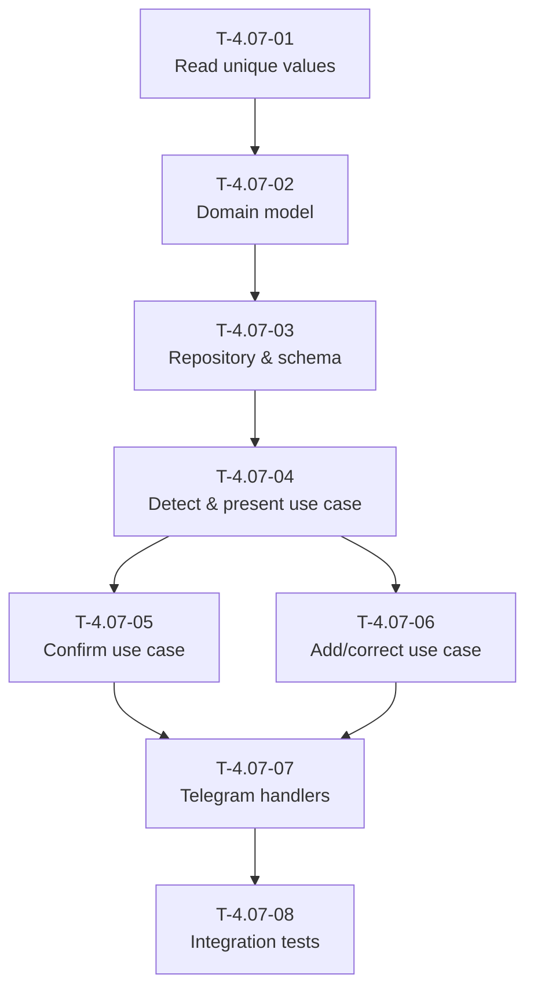

# Task Dependency Tree — HU-4.07

## Textual diagram

```
T-4.07-01  Read unique category values from spreadsheet
    |
    v
T-4.07-02  Define category vocabulary domain model
    |
    v
T-4.07-03  Implement category vocabulary repository and schema
    |
    v
T-4.07-04  Implement detect-and-present categories use case
    |
    +------> T-4.07-05  Implement confirm categories use case
    |            |
    |            v
    |       T-4.07-07  Implement Telegram conversation handlers
    |            ^
    +------> T-4.07-06  Implement add and correct categories use case
                 |
                 v
            T-4.07-07  Implement Telegram conversation handlers
                 |
                 v
            T-4.07-08  Write integration tests and QA coverage
```

## Mermaid graph



## Critical path

The longest chain of dependent tasks determines the minimum duration:

`T-4.07-01 → T-4.07-02 → T-4.07-03 → T-4.07-04 → T-4.07-06 → T-4.07-07 → T-4.07-08`

**Critical path duration:** 1.5 + 0.5 + 1.5 + 1.5 + 1.5 + 1.5 + 1.5 = **9.5 hours**

## Summary table

| Task ID | Title | Depends on | Estimated Hours |
|---------|-------|------------|-----------------|
| T-4.07-01 | Read unique category values from spreadsheet | None | 1.5 |
| T-4.07-02 | Define category vocabulary domain model | T-4.07-01 | 0.5 |
| T-4.07-03 | Implement category vocabulary repository and schema | T-4.07-02 | 1.5 |
| T-4.07-04 | Implement detect-and-present categories use case | T-4.07-03 | 1.5 |
| T-4.07-05 | Implement confirm categories use case | T-4.07-04 | 1.0 |
| T-4.07-06 | Implement add and correct categories via natural language use case | T-4.07-04 | 1.5 |
| T-4.07-07 | Implement Telegram conversation handlers for category confirmation | T-4.07-05, T-4.07-06 | 1.5 |
| T-4.07-08 | Write integration tests and QA coverage | T-4.07-07 | 1.5 |
