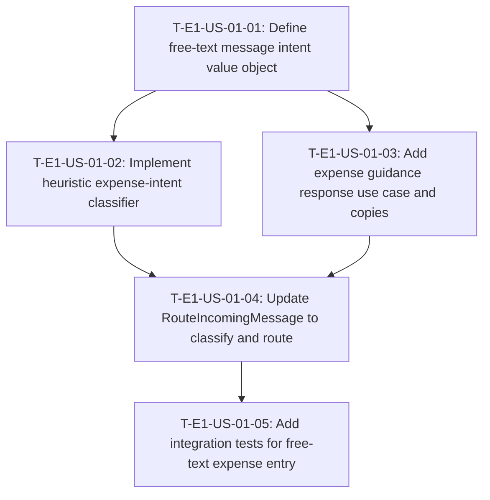

# Dependency Tree — E1-US-01: Send free text to register an expense

## Mermaid diagram

## Sequential list

1. **T-E1-US-01-01** — Define free-text message intent value object (no dependencies)
2. **T-E1-US-01-02** — Implement heuristic expense-intent classifier (depends on T-01)
3. **T-E1-US-01-03** — Add expense guidance response use case and copies (depends on T-01)
4. **T-E1-US-01-04** — Update RouteIncomingMessage to classify and route (depends on T-02, T-03)
5. **T-E1-US-01-05** — Add integration tests for free-text expense entry (depends on T-04)

## Critical path

**T-E1-US-01-01** → **T-E1-US-01-02** → **T-E1-US-01-04** → **T-E1-US-01-05** = **1.5 + 2.5 + 2.0 + 2.5 = 8.5 hours**

T-03 (1.5 h) runs in parallel with T-02 after T-01 is done, so it does not lengthen the critical path.

## Summary table

| Task ID | Title | Depends on | Estimated Hours |
|---|---|---|---|
| T-E1-US-01-01 | Define free-text message intent value object | None | 1.5 |
| T-E1-US-01-02 | Implement heuristic expense-intent classifier | T-E1-US-01-01 | 2.5 |
| T-E1-US-01-03 | Add expense guidance response use case and copies | T-E1-US-01-01 | 1.5 |
| T-E1-US-01-04 | Update RouteIncomingMessage to classify and route | T-E1-US-01-02, T-E1-US-01-03 | 2.0 |
| T-E1-US-01-05 | Add integration tests for free-text expense entry | T-E1-US-01-04 | 2.5 |
