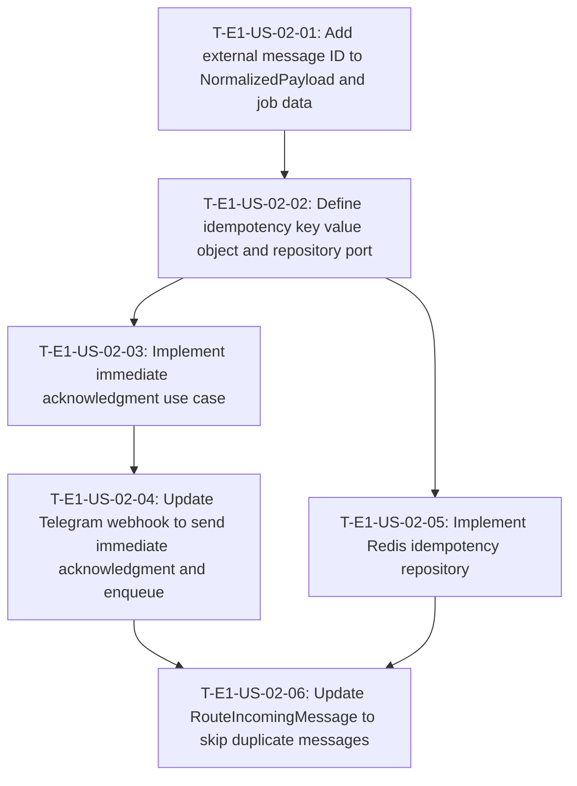

# Dependency Tree — E1-US-02: Immediate acknowledgment of receipt

## Mermaid diagram

## Sequential list

1. **T-E1-US-02-01** — Add external message ID to NormalizedPayload and job data (no dependencies)
2. **T-E1-US-02-02** — Define idempotency key value object and repository port (depends on T-E1-US-02-01)
3. **T-E1-US-02-03** — Implement immediate acknowledgment use case (depends on T-E1-US-02-02)
4. **T-E1-US-02-04** — Update Telegram webhook to send immediate acknowledgment and enqueue (depends on T-E1-US-02-03)
5. **T-E1-US-02-05** — Implement Redis idempotency repository (depends on T-E1-US-02-02)
6. **T-E1-US-02-06** — Update RouteIncomingMessage to skip duplicate messages (depends on T-E1-US-02-04, T-E1-US-02-05)

## Critical path

**T-E1-US-02-01** → **T-E1-US-02-02** → **T-E1-US-02-03** → **T-E1-US-02-04** → **T-E1-US-02-06** = **1.0 + 1.0 + 1.5 + 2.0 + 1.0 = 6.5 hours**

T-E1-US-02-05 (1.5 h) runs in parallel with T-E1-US-02-03 → T-E1-US-02-04 after T-E1-US-02-02 is done, so it does not lengthen the critical path.

## Summary table

| Task ID | Title | Depends on | Estimated Hours |
|---|---|---|---|
| T-E1-US-02-01 | Add external message ID to NormalizedPayload and job data | None | 1.0 |
| T-E1-US-02-02 | Define idempotency key value object and repository port | T-E1-US-02-01 | 1.0 |
| T-E1-US-02-03 | Implement immediate acknowledgment use case | T-E1-US-02-02 | 1.5 |
| T-E1-US-02-04 | Update Telegram webhook to send immediate acknowledgment and enqueue | T-E1-US-02-03 | 2.0 |
| T-E1-US-02-05 | Implement Redis idempotency repository | T-E1-US-02-02 | 1.5 |
| T-E1-US-02-06 | Update RouteIncomingMessage to skip duplicate messages | T-E1-US-02-04, T-E1-US-02-05 | 1.0 |
