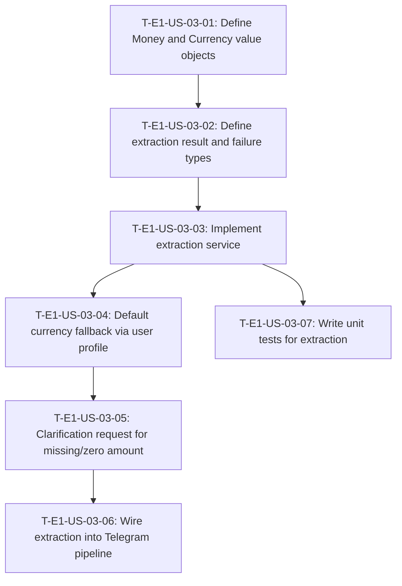

# Dependency tree — E1-US-03: Amount and currency detection

## Mermaid graph

## Critical path

The longest chain of dependent tasks is:

`T-E1-US-03-01` → `T-E1-US-03-02` → `T-E1-US-03-03` → `T-E1-US-03-04` → `T-E1-US-03-05` → `T-E1-US-03-06`

Critical path duration: **16 hours**

`T-E1-US-03-07` (tests) can run in parallel after `T-E1-US-03-03` is complete.

## Summary table

| Task ID | Title | Depends on | Estimated hours |
|---|---|---|---|
| T-E1-US-03-01 | Define Money and Currency value objects | None | 2 |
| T-E1-US-03-02 | Define extraction result and failure types | T-E1-US-03-01 | 1 |
| T-E1-US-03-03 | Implement extraction service | T-E1-US-03-02 | 5 |
| T-E1-US-03-04 | Default currency fallback via user profile | T-E1-US-03-03 | 2 |
| T-E1-US-03-05 | Clarification request for missing or zero amount | T-E1-US-03-04 | 2 |
| T-E1-US-03-06 | Wire extraction into Telegram pipeline | T-E1-US-03-05 | 3 |
| T-E1-US-03-07 | Write unit tests for extraction service | T-E1-US-03-03 | 3 |
| **Total** | | | **18** |
