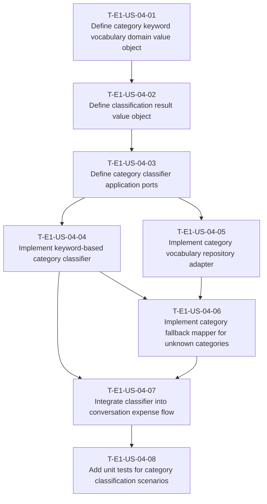

# Dependency Tree — E1-US-04

## Mermaid graph

## Critical path

The longest chain of dependent tasks determines the minimum duration:

`T-E1-US-04-01 → T-E1-US-04-02 → T-E1-US-04-03 → T-E1-US-04-04 → T-E1-US-04-06 → T-E1-US-04-07 → T-E1-US-04-08`

Duration: **17 hours**.

A parallel chain through the vocabulary repository adapter is shorter:
`T-E1-US-04-03 → T-E1-US-04-05 → T-E1-US-04-06` = 7 hours, so it does not extend the critical path.

## Summary table

| Task ID | Title | Depends on | Estimated Hours |
|---|---|---|---|
| T-E1-US-04-01 | Define category keyword vocabulary domain value object | None | 2 |
| T-E1-US-04-02 | Define classification result value object | T-E1-US-04-01 | 1 |
| T-E1-US-04-03 | Define category classifier application ports | T-E1-US-04-02 | 2 |
| T-E1-US-04-04 | Implement keyword-based category classifier | T-E1-US-04-03 | 5 |
| T-E1-US-04-05 | Implement category vocabulary repository adapter | T-E1-US-04-03 | 3 |
| T-E1-US-04-06 | Implement category fallback mapper for unknown categories | T-E1-US-04-04, T-E1-US-04-05 | 2 |
| T-E1-US-04-07 | Integrate classifier into conversation expense flow | T-E1-US-04-04, T-E1-US-04-06 | 2 |
| T-E1-US-04-08 | Add unit tests for category classification scenarios | T-E1-US-04-07 | 3 |
| **Total** | | | **20** |
