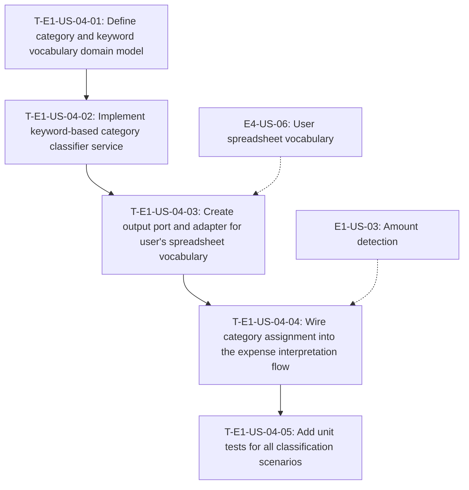

# Dependency Tree — E1-US-04: Category assignment by text keywords

## Mermaid diagram

## Sequential list

1. **T-E1-US-04-01** — Define category and keyword vocabulary domain model (no dependencies)
2. **T-E1-US-04-02** — Implement keyword-based category classifier service (depends on T-01)
3. **T-E1-US-04-03** — Create output port and adapter for user's spreadsheet vocabulary (depends on T-02 + external E4-US-06)
4. **T-E1-US-04-04** — Wire category assignment into the interpretation flow (depends on T-03 + external E1-US-03)
5. **T-E1-US-04-05** — Add unit tests for all classification scenarios (depends on T-04)

## Critical path

**T-E1-US-04-01** → **T-E1-US-04-02** → **T-E1-US-04-03** → **T-E1-US-04-04** → **T-E1-US-04-05** = **2 + 2.5 + 2 + 2 + 2.5 = 11 hours**

The chain is purely sequential — each task depends on the previous one — so the critical path equals the total duration.

## Summary table

| Task ID | Title | Depends on | Estimated Hours |
|---|---|---|---|
| T-E1-US-04-01 | Define category and keyword vocabulary domain model | None | 2 |
| T-E1-US-04-02 | Implement keyword-based category classifier service | T-E1-US-04-01 | 2.5 |
| T-E1-US-04-03 | Create output port and adapter for user's spreadsheet vocabulary | T-E1-US-04-02, E4-US-06 | 2 |
| T-E1-US-04-04 | Wire category assignment into the expense interpretation flow | T-E1-US-04-03, E1-US-03 | 2 |
| T-E1-US-04-05 | Add unit tests for all classification scenarios | T-E1-US-04-04 | 2.5 |
