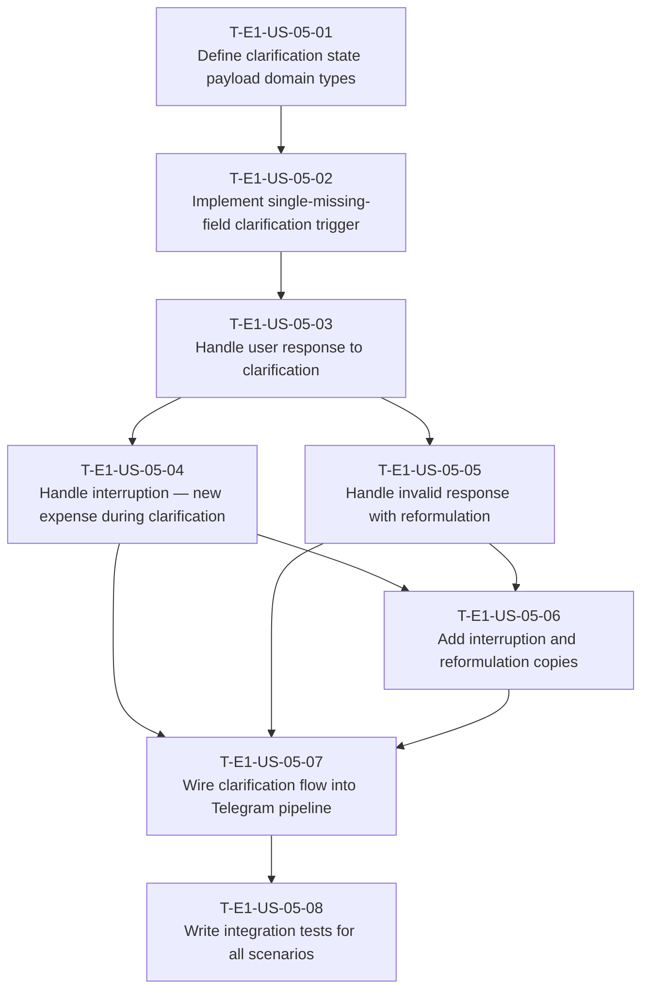

# Dependency Tree — E1-US-05: Clarification request for ambiguous or missing data

## Mermaid graph

## Critical path

The longest chain of dependent tasks determines the minimum duration:

`T-E1-US-05-01 → T-E1-US-05-02 → T-E1-US-05-03 → T-E1-US-05-04 → T-E1-US-05-06 → T-E1-US-05-07 → T-E1-US-05-08`

Duration: **16 hours**

A parallel chain through the invalid response reformulation is shorter:
`T-E1-US-05-03 → T-E1-US-05-05 → T-E1-US-05-06` = 6 hours, so it does not extend the critical path.

## Summary table

| Task ID | Title | Depends on | Estimated Hours |
|---|---|---|---|
| T-E1-US-05-01 | Define clarification state payload domain types | None | 1 |
| T-E1-US-05-02 | Implement single-missing-field clarification trigger | T-E1-US-05-01 | 3 |
| T-E1-US-05-03 | Handle user response to clarification | T-E1-US-05-02 | 3 |
| T-E1-US-05-04 | Handle interruption — new expense during clarification | T-E1-US-05-03 | 3 |
| T-E1-US-05-05 | Handle invalid response with reformulation | T-E1-US-05-03 | 2 |
| T-E1-US-05-06 | Add interruption and reformulation copies | T-E1-US-05-04, T-E1-US-05-05 | 1 |
| T-E1-US-05-07 | Wire clarification flow into Telegram pipeline | T-E1-US-05-04, T-E1-US-05-05, T-E1-US-05-06 | 3 |
| T-E1-US-05-08 | Write integration tests for all scenarios | T-E1-US-05-07 | 3 |
| **Total** | | | **19** |
