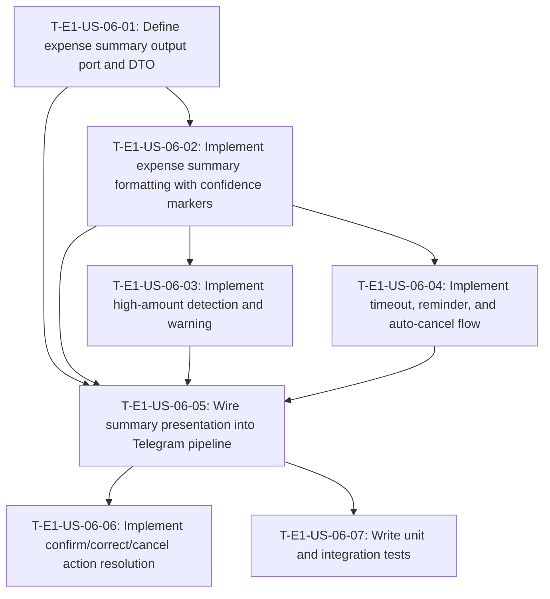

# Dependency tree — E1-US-06: Interpreted expense summary for review

## Mermaid graph

## Critical path

The longest chain of dependent tasks is:

`T-E1-US-06-01` → `T-E1-US-06-02` → `T-E1-US-06-04` → `T-E1-US-06-05` → `T-E1-US-06-06`

Critical path duration: **8 hours**

`T-E1-US-06-03` can be done in parallel after `T-E1-US-06-02`.
`T-E1-US-06-07` (tests) runs after `T-E1-US-06-05`.

## Summary table

| Task ID | Title | Depends on | Estimated hours |
|---|---|---|---|
| T-E1-US-06-01 | Define expense summary output port and DTO | None | 1 |
| T-E1-US-06-02 | Implement expense summary formatting with confidence markers | T-E1-US-06-01 | 2 |
| T-E1-US-06-03 | Implement high-amount detection and warning | T-E1-US-06-02 | 1 |
| T-E1-US-06-04 | Implement timeout, reminder, and auto-cancel flow | T-E1-US-06-02 | 2 |
| T-E1-US-06-05 | Wire summary presentation into Telegram pipeline | T-E1-US-06-01, T-E1-US-06-02, T-E1-US-06-03, T-E1-US-06-04 | 2 |
| T-E1-US-06-06 | Implement confirm/correct/cancel action resolution | T-E1-US-06-05 | 1 |
| T-E1-US-06-07 | Write unit and integration tests | T-E1-US-06-05 | 3 |
| **Total** | | | **12** |
