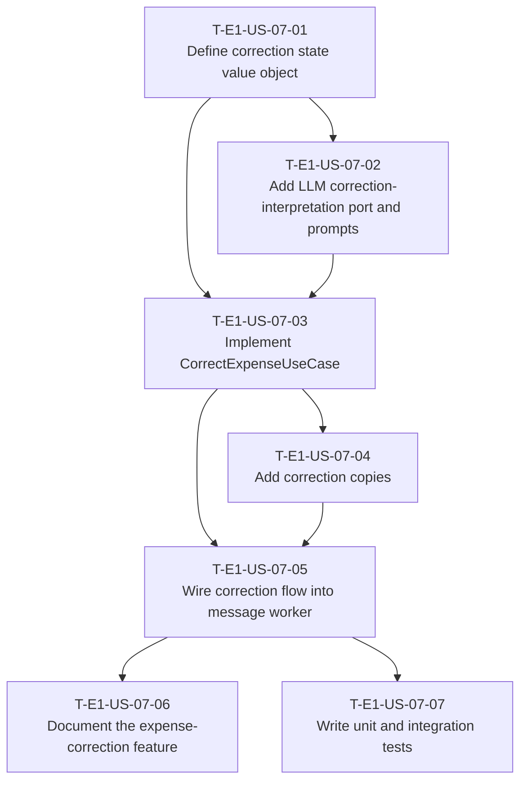

# Dependency Tree — E1-US-07: Correct an erroneous field in natural language

## Mermaid graph

## Critical path

The longest chain of dependent tasks determines the minimum duration:

`T-E1-US-07-01 → T-E1-US-07-02 → T-E1-US-07-03 → T-E1-US-07-04 → T-E1-US-07-05 → T-E1-US-07-07`

Duration: **17 hours** (1 + 4 + 5 + 1 + 3 + 3)

The documentation branch is shorter: `T-E1-US-07-05 → T-E1-US-07-06` = 4 hours, so it does not extend the critical path. Tasks T-E1-US-07-01 and T-E1-US-07-02 can be started in parallel on day one.

## Summary table

| Task ID       | Title                                              | Depends on                   | Estimated Hours |
| ------------- | -------------------------------------------------- | ---------------------------- | --------------- |
| T-E1-US-07-01 | Define correction state value object               | None                         | 1               |
| T-E1-US-07-02 | Add LLM correction-interpretation port and prompts | T-E1-US-07-01                | 4               |
| T-E1-US-07-03 | Implement CorrectExpenseUseCase                    | T-E1-US-07-01, T-E1-US-07-02 | 5               |
| T-E1-US-07-04 | Add correction copies                              | T-E1-US-07-03                | 1               |
| T-E1-US-07-05 | Wire correction flow into message worker           | T-E1-US-07-03, T-E1-US-07-04 | 3               |
| T-E1-US-07-06 | Document the expense-correction feature            | T-E1-US-07-05                | 1               |
| T-E1-US-07-07 | Write unit and integration tests                   | T-E1-US-07-05                | 3               |
| **Total**     |                                                    |                              | **18**          |
