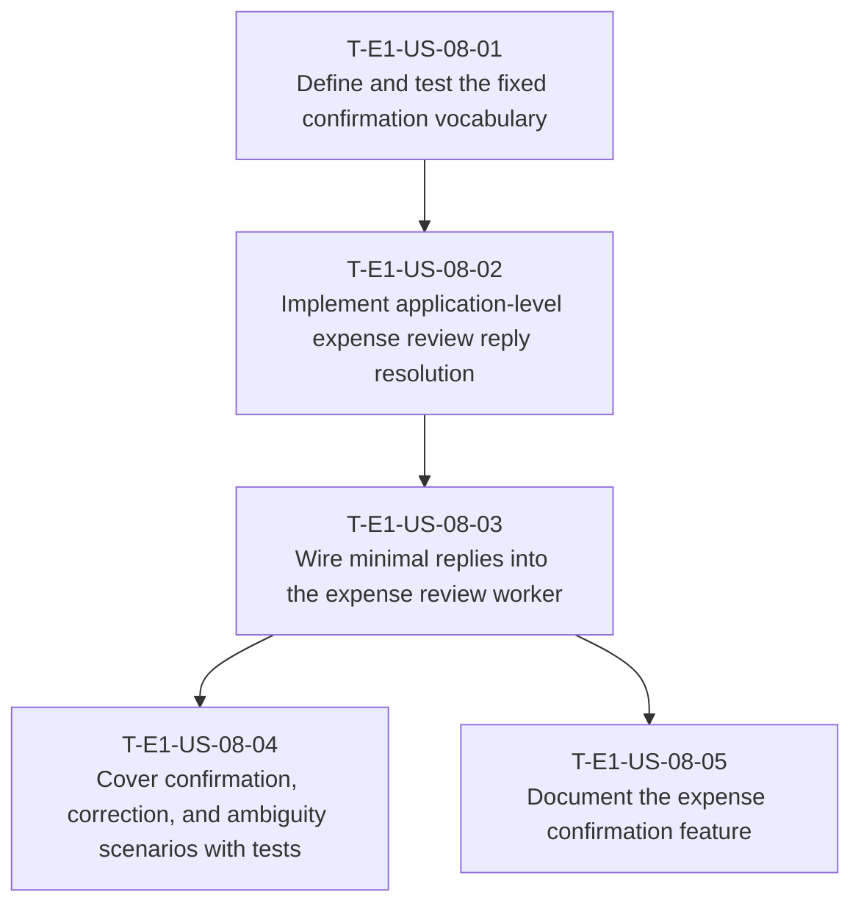

# Dependency Tree — E1-US-08: Confirm expense registration with a minimal response

## Mermaid graph

## Critical path

The longest dependency chain is:

`T-E1-US-08-01 → T-E1-US-08-02 → T-E1-US-08-03 → T-E1-US-08-04`

Duration: **7 hours** (1.5 + 2.5 + 1.5 + 1.5)

The documentation branch takes 6.5 hours from the start (`T-E1-US-08-01 → T-E1-US-08-02 → T-E1-US-08-03 → T-E1-US-08-05`) and does not extend the critical path.

## Summary table

| Task ID | Title | Depends on | Estimated Hours |
| --- | --- | --- | ---: |
| T-E1-US-08-01 | Define and test the fixed confirmation vocabulary | E1-US-06, E1-US-07 | 1.5 |
| T-E1-US-08-02 | Implement application-level expense review reply resolution | T-E1-US-08-01, E1-US-06, E1-US-07, E1-US-10 save contract | 2.5 |
| T-E1-US-08-03 | Wire minimal replies into the expense review worker | T-E1-US-08-02 | 1.5 |
| T-E1-US-08-04 | Cover confirmation, correction, and ambiguity scenarios with tests | T-E1-US-08-03 | 1.5 |
| T-E1-US-08-05 | Document the expense confirmation feature | T-E1-US-08-03 | 1 |
| **Total** |  |  | **8** |

