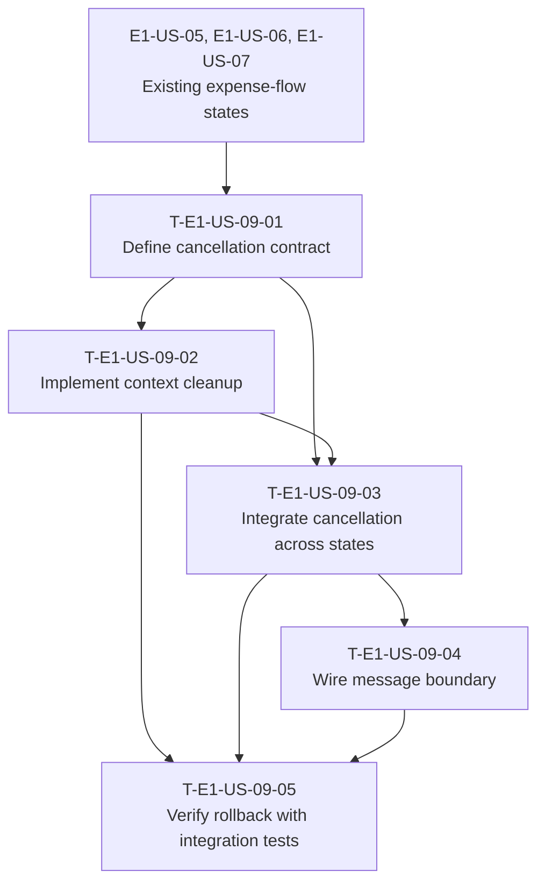

# Dependency Tree — E1-US-09

## Dependency diagram

## Critical path

`E1-US-05/E1-US-06/E1-US-07 → T-E1-US-09-01 → T-E1-US-09-02 → T-E1-US-09-03 → T-E1-US-09-04 → T-E1-US-09-05`

Estimated critical-path duration: **11.5 hours**.

## Summary

| Task ID | Title | Depends on | Estimated Hours |
| --- | --- | --- | ---: |
| T-E1-US-09-01 | Define the cancellation contract | E1-US-05, E1-US-06, E1-US-07 | 2 |
| T-E1-US-09-02 | Implement complete conversation-context cleanup | T-E1-US-09-01 | 2.5 |
| T-E1-US-09-03 | Integrate cancellation across expense-flow states | T-E1-US-09-01, T-E1-US-09-02 | 3 |
| T-E1-US-09-04 | Wire the message boundary to the cancellation use case | T-E1-US-09-03 | 1.5 |
| T-E1-US-09-05 | Verify cancellation rollback with integration tests | T-E1-US-09-02, T-E1-US-09-03, T-E1-US-09-04 | 2.5 |
