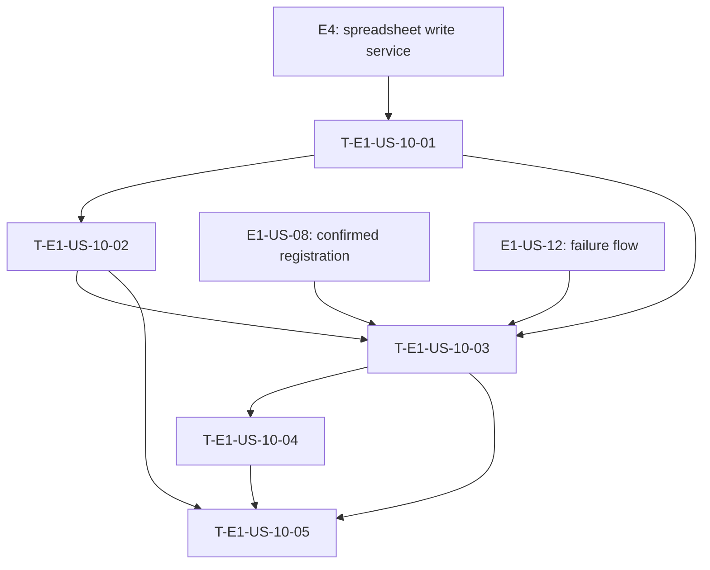

# Dependency tree — E1-US-10

**Critical path:** E4 → T-E1-US-10-01 → T-E1-US-10-02 → T-E1-US-10-03 → T-E1-US-10-04 → T-E1-US-10-05 (9.5 hours of story work).

| Task ID | Title | Depends on | Estimated hours |
| --- | --- | --- | ---: |
| T-E1-US-10-01 | Define save-location result contract | E4 spreadsheet-writing contract | 1.5 |
| T-E1-US-10-02 | Return location metadata from the spreadsheet adapter | T-E1-US-10-01 | 2.5 |
| T-E1-US-10-03 | Orchestrate successful save confirmation | T-E1-US-10-01, T-E1-US-10-02, E1-US-08, E1-US-12 | 2.5 |
| T-E1-US-10-04 | Render and deliver the location-aware chat confirmation | T-E1-US-10-03 | 1.5 |
| T-E1-US-10-05 | Verify save-location confirmation flows | T-E1-US-10-02, T-E1-US-10-03, T-E1-US-10-04 | 1.5 |
