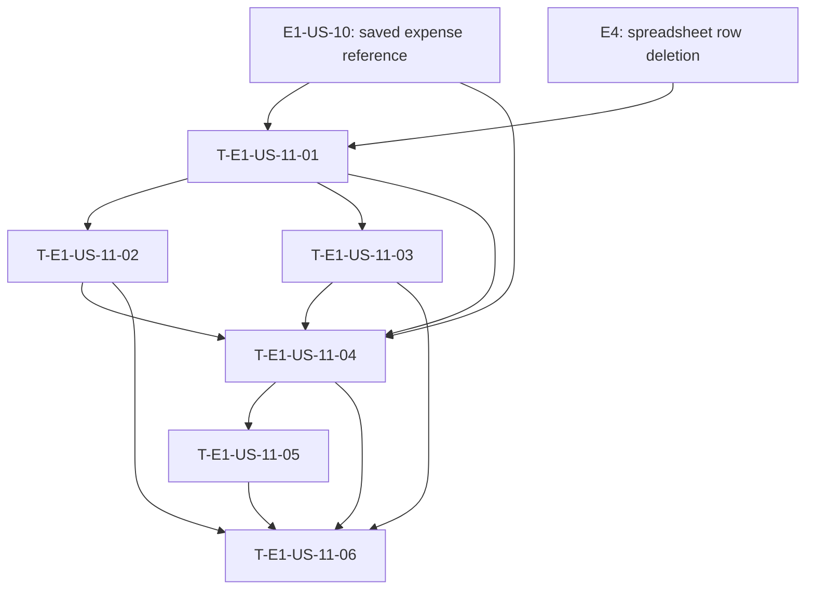

# Dependency tree - E1-US-11

**Critical path:** E1-US-10 / E4 -> T-E1-US-11-01 -> T-E1-US-11-02 or T-E1-US-11-03 -> T-E1-US-11-04 -> T-E1-US-11-05 -> T-E1-US-11-06 (14 hours of story work). Tasks 02 and 03 can proceed in parallel after Task 01; both must be complete before Task 04.

| Task ID | Title | Depends on | Estimated hours |
| --- | --- | --- | ---: |
| T-E1-US-11-01 | Define undo operation contracts | E1-US-10, E4 | 1.5 |
| T-E1-US-11-02 | Persist the latest undoable expense state | T-E1-US-11-01, E1-US-10 | 2 |
| T-E1-US-11-03 | Delete a spreadsheet row by saved reference | T-E1-US-11-01, E4 | 2.5 |
| T-E1-US-11-04 | Orchestrate last-expense undo | T-E1-US-11-01, T-E1-US-11-02, T-E1-US-11-03, E1-US-10 | 3.5 |
| T-E1-US-11-05 | Route undo commands and messages | T-E1-US-11-04 | 2 |
| T-E1-US-11-06 | Verify undo flows | T-E1-US-11-02, T-E1-US-11-03, T-E1-US-11-04, T-E1-US-11-05 | 2.5 |
