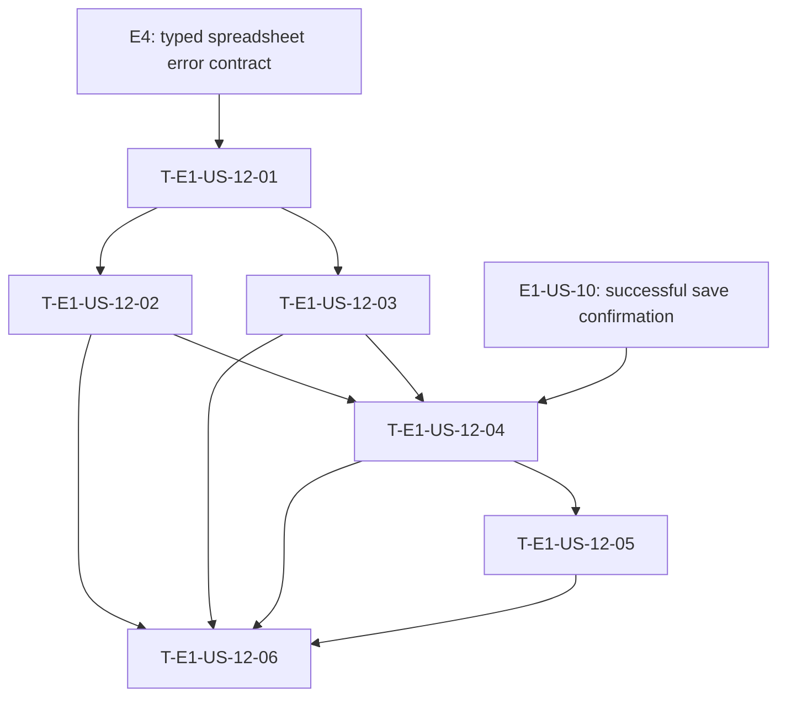

# Dependency tree - E1-US-12

**Critical path:** E4 -> T-E1-US-12-01 -> T-E1-US-12-02 -> T-E1-US-12-04 -> T-E1-US-12-05 -> T-E1-US-12-06 (15 hours of story work).

| Task ID | Title | Depends on | Estimated hours |
| --- | --- | --- | ---: |
| T-E1-US-12-01 | Define typed spreadsheet failure categories | E4 spreadsheet error contract | 2 |
| T-E1-US-12-02 | Map provider failures to typed categories | T-E1-US-12-01, E4 | 3 |
| T-E1-US-12-03 | Preserve failed expense data with retry TTL | T-E1-US-12-01 | 3 |
| T-E1-US-12-04 | Orchestrate failure notifications and recovery paths | T-E1-US-12-02, T-E1-US-12-03, E1-US-10 | 4 |
| T-E1-US-12-05 | Route retry and reconfiguration commands | T-E1-US-12-04 | 2.5 |
| T-E1-US-12-06 | Verify failure, retry, fallback, and silent-failure scenarios | T-E1-US-12-02, T-E1-US-12-03, T-E1-US-12-04, T-E1-US-12-05 | 3.5 |
