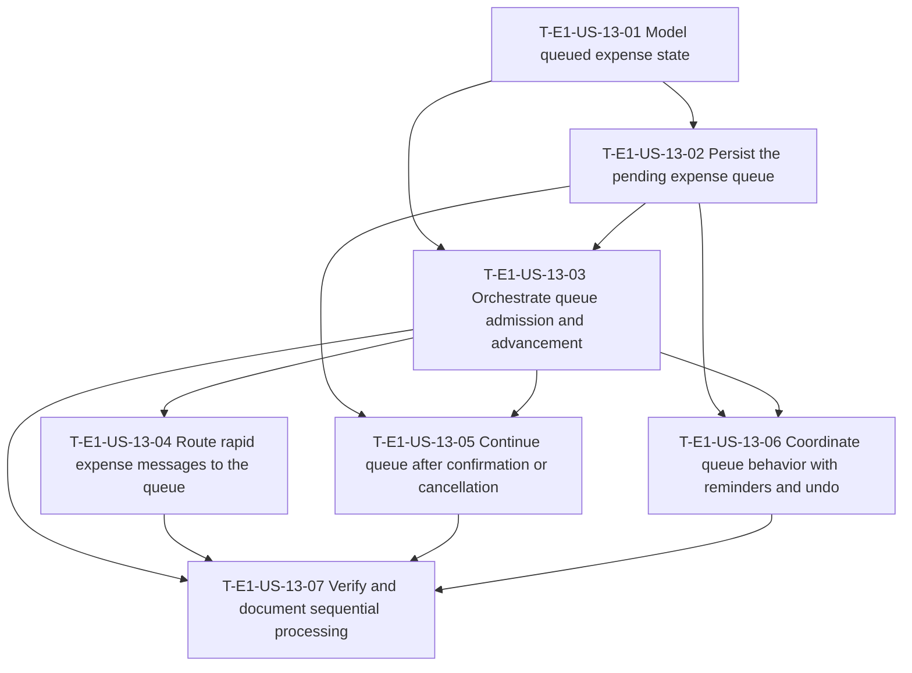

# Dependency tree — E1-US-13

**Critical path:** T-E1-US-13-01 → T-E1-US-13-02 → T-E1-US-13-03 → T-E1-US-13-06 → T-E1-US-13-07 (24 hours). T-E1-US-13-05 and T-E1-US-13-06 can proceed in parallel after T-E1-US-13-03.

| Task ID | Title | Depends on | Estimated hours |
| --- | --- | --- | ---: |
| T-E1-US-13-01 | Model queued expense state | None | 3 |
| T-E1-US-13-02 | Persist the pending expense queue | T-E1-US-13-01 | 5 |
| T-E1-US-13-03 | Orchestrate queue admission and advancement | T-E1-US-13-01, T-E1-US-13-02 | 6 |
| T-E1-US-13-04 | Route rapid expense messages to the queue | T-E1-US-13-03 | 4 |
| T-E1-US-13-05 | Continue the queue after confirmation or cancellation | T-E1-US-13-02, T-E1-US-13-03 | 4 |
| T-E1-US-13-06 | Coordinate queue behavior with reminders and undo | T-E1-US-13-02, T-E1-US-13-03 | 5 |
| T-E1-US-13-07 | Verify and document sequential expense processing | T-E1-US-13-03, T-E1-US-13-04, T-E1-US-13-05, T-E1-US-13-06 | 5 |
